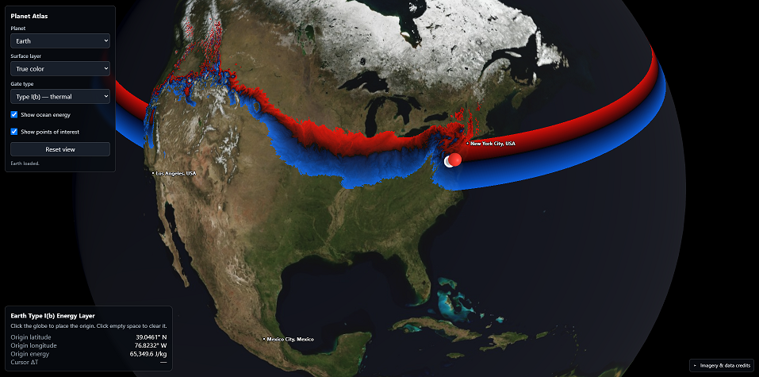

# Hyades Planet Atlas

An interactive browser-based globe for exploring planetary surface imagery, points of interest, routes, and the energy constraints of fictional **Type I Gates**.



The atlas currently supports multiple planets and provides three surface layers:

- true-color imagery
- black-and-white contour maps
- isoenergetic maps

It also includes an interactive origin pin that visualizes which destinations can be reached under the energy-conservation rules used by Type I Gate technology in the *Hyades Threshold* setting.

> **Note:** Type I Gates and the associated physics model are fictional. The planetary topography and imagery may incorporate real scientific datasets, but the Gate system is a worldbuilding and visualization framework.

---

## Launch the Atlas

[Open the Hyades Planet Atlas](https://sarafanunin.github.io/Hyades-Planet-Atlas/)

## What Is a Type I Gate?

A **Type I Gate** is a portal that obeys conservation of energy.

Matter passing through the Gate cannot simply appear at a destination with a different gravitational, rotational, or kinetic energy state unless that energy difference is accounted for. The atlas represents this using a precomputed total-energy raster for each planet. This version does not yet utilize geoid models that factor in specific gravity, however while rock density is significant, its influence is 2-3 orders of magnitude weaker than latitude or elevation.

In simplified terms:

- traveling to a destination with **higher mechanical energy** requires energy;
- traveling to a destination with **lower mechanical energy** releases energy;
- a Type I Gate must balance that difference rather than creating or destroying energy.

The current atlas focuses on planetary surface-to-surface travel and compares the specific mechanical energy of the selected origin with every possible destination on the same world. To travel between worlds, a different model is necessary.

---

## Type I(a) Gates

A **Type I(a) Gate** conserves mechanical energy directly.

For the purposes of this atlas, a destination is treated as reachable when its stored specific mechanical energy is very close to that of the selected origin.

The current visualization uses an approximate tolerance equivalent to:

```text
±0.05 °C
```

This temperature figure is only a convenient way of expressing a small energy difference using the same scale as the Type I(b) display. It does **not** mean that a Type I(a) Gate performs thermal conversion.

When Type I(a) mode is selected:

- reachable or nearly matched destinations are highlighted in **yellow**;
- areas outside the selected tolerance remain unhighlighted.

This is a map-level approximation of an energy match. It does not guarantee that every momentum-state or navigation requirement has been satisfied.

---

## Type I(b) Gates

A **Type I(b) Gate** may exchange mechanical energy with thermal energy while still conserving total energy.

If a traveler arrives at a destination with less mechanical energy than the origin, the excess energy is deposited as heat. If the destination requires more mechanical energy, the traveler must supply that energy by cooling.

The atlas converts the specific-energy difference into an equivalent temperature change using:

```text
2,500 J/(kg·°C)
```

This is the assumed effective specific heat capacity of a traveler.

The current safety window to prevent hypothermia or hyperthermia is:

```text
-2.0 °C to +1.5 °C
```

In Type I(b) mode:

- **blue** indicates a destination that would cool the traveler;
- **red** indicates a destination that would heat the traveler;
- very dark areas are close to an energy match;
- destinations outside the configured thermal safety range are not highlighted.

The displayed temperature change is an idealized whole-body equivalent; how much would your total average temperature change.

---

## Using the Atlas

### 1. Run a local web server

Because the atlas loads textures, text files, JSON metadata, and binary raster data with `fetch()`, it should be served through HTTP rather than opened directly as a local file.

From the project directory, run:

```bash
python -m http.server
```

Then use your web browser to open:

```text
http://localhost:8000/
```

### 2. Select a planet

Use the **Planet** menu in the upper-left control panel.

The atlas loads that planet's surface texture, energy raster, energy metadata, points of interest, and routes. Switching planets clears the current origin pin.

### 3. Select a surface layer

Use the **Surface layer** menu.

Available layers are:

- **True color** — ordinary planetary imagery
- **Black-and-white contours** — elevation contours
- **Isoenergetic rainbow** — a static overview of total surface energy

The static isoenergetic texture is different from the interactive Gate overlay. The texture shows the planet's overall energy distribution, while the overlay shows energy differences relative to a selected origin. The interactive overlay is recalculated in real time from the selected origin, so every click produces a different reachability map.

### 4. Select a Gate type

Use the **Gate type** menu.

- **Type I(a) — mechanical match:** highlights destinations whose specific mechanical energy is nearly equal to that of the selected origin.
- **Type I(b) — thermal:** shows the equivalent heating or cooling required to balance the difference between the origin and destination.

### 5. Place the origin pin

Click anywhere on the globe to place the origin.

The lower-left information panel displays:

- origin latitude
- origin longitude
- origin specific energy
- cursor temperature difference

Click empty space outside the globe to remove the origin pin and clear the overlay. Dragging the globe rotates the view without intentionally moving the pin.

### 6. Inspect possible destinations

After placing the origin pin, move the cursor across the globe.

The **Cursor ΔT** field shows the equivalent Type I(b) temperature change for a trip from the selected origin to the location under the cursor.

A positive value means the trip releases mechanical energy and heats the traveler. A negative value means the trip requires mechanical energy and cools the traveler.

### 7. Show or hide ocean energy

Enable **Show ocean energy** to include ocean cells in the interactive overlay.

When it is disabled, ocean destinations remain visible as ordinary surface imagery but are excluded from the Gate-energy coloration.

For the current datasets, ocean cells may use sea-level-clamped energy values rather than the energy of the underlying seabed. This models travel to the ocean surface rather than to the seafloor.

### 8. Show points of interest

Enable **Show points of interest** to display named locations and routes.

Single locations appear as labeled dots. Routes appear as connected waypoint lines with dots at each supplied coordinate. A route receives one label near its middle waypoint.

### 9. Reset the view

Use **Reset view** to clear the origin pin, return the camera to its default position, and restore the default viewing orientation.

---

## Mouse Controls

| Action | Control |
|---|---|
| Rotate globe | Click and drag |
| Zoom | Mouse wheel |
| Place origin | Click globe |
| Clear origin | Click empty space |
| Inspect destination ΔT | Move cursor over globe after placing origin |

---

## Expected Project Structure

```text
index.html
data/
    credits.txt
    earth/
        POI.txt
        total_energy_j_per_kg.json
        total_energy_j_per_kg.f32
    mars/
        POI.txt
        total_energy_j_per_kg.json
        total_energy_j_per_kg.f32
    cleeia/
        POI.txt
        total_energy_j_per_kg.json
        total_energy_j_per_kg.f32
    synecho/
        POI.txt
        total_energy_j_per_kg.json
        total_energy_j_per_kg.f32
textures/
    earth/
        true_color.jpg
        contours.png
        isoenergetic.png
    mars/
        true_color.png
        contours.png
        isoenergetic.png
    cleeia/
        true_color.png
        contours.png
        isoenergetic.png
    synecho/
        true_color.png
        contours.png
        isoenergetic.png
```

---

## Points-of-Interest File Format

Each planet may include a `POI.txt` file.

### Single point

```text
Location Name / 8N / 12W
```

### Route

```text
Route Name /
8N / 12W /
7.5N / 11W /
6N / 9W
```

Blank lines and lines beginning with `#` are ignored. Latitude must use `N` or `S`. Longitude must use `E` or `W`.

---

## Energy Raster Files

Each planet uses two files:

```text
total_energy_j_per_kg.json
total_energy_j_per_kg.f32
```

The JSON file provides the raster dimensions and binary-file metadata.

The `.f32` file contains little-endian 32-bit floating-point values representing stored specific energy in joules per kilogram.

The present encoding convention is:

- positive value — land or above-sea-level cell;
- negative value — ocean or sea-level-clamped cell;
- absolute value — stored specific energy used in calculations.

---

## Credits

Imagery and data acknowledgments are loaded from:

```text
data/credits.txt
```

The credits panel appears in the lower-right corner of the atlas. URLs in the file are automatically converted into links.

During local development, a browser may cache this file. A hard refresh or disabling the browser cache in developer tools may be necessary after editing it.

---

## Browser Requirements

The atlas requires a modern browser with JavaScript modules, WebGL, floating-point texture support, and the Fetch API.

Current desktop versions of Chrome, Edge, and Firefox should be suitable.

---

## License and Third-Party Assets

The source code, original planetary assets, and third-party imagery may have different licensing terms.

Before redistributing or publicly hosting the atlas, verify the license and attribution requirements for every included texture, elevation model, and derived dataset.

See `data/credits.txt` for current imagery and data acknowledgments.
